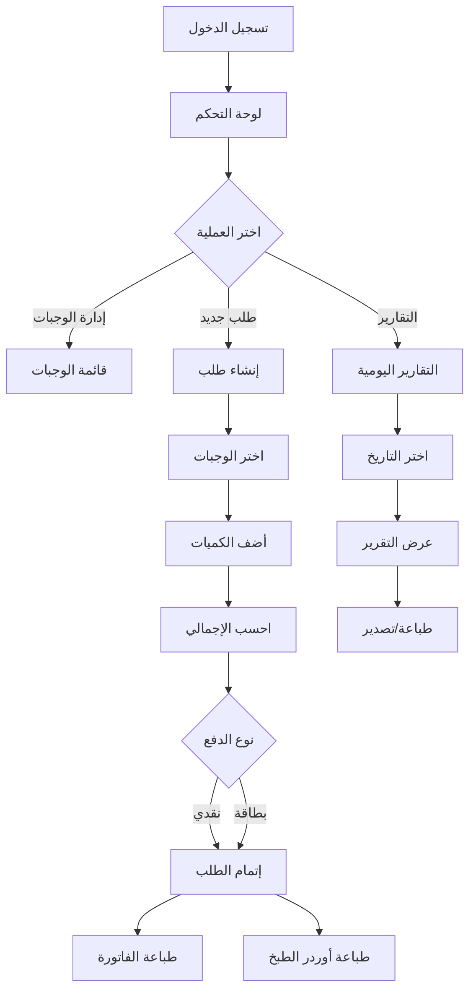

# خطة تطبيق كاشير مطعم (POS System)

## نظرة عامة على البنية

التطبيق سيكون نظام نقطة بيع للمطاعم يتضمن:

- إدارة قائمة الوجبات
- تسجيل الطلبات
- طباعة الفواتير والأوردرات
- تقارير يومية عن المبيعات

## البنية التقنية

### Backend

- **Laravel** (أحدث إصدار مستقر)
- **MySQL** قاعدة البيانات
- **Blade Templates** للواجهة

### Frontend

- **Bootstrap 5** للتنسيق والتصميم المتجاوب
- **jQuery** للتفاعلات الديناميكية
- **Print.js** أو CSS Print Media لطباعة الفواتير

## هيكل المشروع

```
new_pos/
├── app/
│   ├── Http/Controllers/
│   │   ├── AuthController.php
│   │   ├── MealController.php
│   │   ├── OrderController.php
│   │   ├── InvoiceController.php
│   │   └── ReportController.php
│   ├── Models/
│   │   ├── User.php
│   │   ├── Meal.php
│   │   ├── Order.php
│   │   ├── OrderItem.php
│   │   └── Payment.php
│   └── Services/
│       ├── OrderService.php
│       └── ReportService.php
├── database/
│   ├── migrations/
│   │   ├── create_users_table.php
│   │   ├── create_meals_table.php
│   │   ├── create_orders_table.php
│   │   ├── create_order_items_table.php
│   │   └── create_payments_table.php
│   └── seeders/
│       ├── UserSeeder.php
│       └── MealSeeder.php
├── resources/
│   ├── views/
│   │   ├── layouts/
│   │   │   └── app.blade.php
│   │   ├── auth/
│   │   │   └── login.blade.php
│   │   ├── meals/
│   │   │   ├── index.blade.php
│   │   │   └── create.blade.php
│   │   ├── orders/
│   │   │   ├── index.blade.php
│   │   │   ├── create.blade.php
│   │   │   └── show.blade.php
│   │   ├── invoices/
│   │   │   └── print.blade.php
│   │   └── reports/
│   │       └── daily.blade.php
│   └── js/
│       └── pos.js
└── routes/
    └── web.php
```

## قاعدة البيانات

### الجداول الأساسية

1. **users** - المستخدمين

   - id, name, email, password, role (admin/cashier), created_at, updated_at

2. **meals** - الوجبات

   - id, name, name_ar, description, price, category, image, is_available, created_at, updated_at

3. **orders** - الطلبات

   - id, order_number, user_id, total_amount, status (pending/completed/cancelled), payment_method (cash/card), created_at, updated_at

4. **order_items** - عناصر الطلب

   - id, order_id, meal_id, quantity, price, subtotal, created_at, updated_at

5. **payments** - المدفوعات (اختياري للتوسع)

   - id, order_id, amount, payment_method, created_at, updated_at

## الميزات الرئيسية

### 1. إدارة الوجبات (Meals Management)

- عرض قائمة الوجبات مع الصور والأسعار
- إضافة/تعديل/حذف وجبات
- تصنيف الوجبات (مشروبات، أطباق رئيسية، حلويات، إلخ)
- تفعيل/تعطيل توفر الوجبة

### 2. إدارة الطلبات (Orders Management)

- إنشاء طلب جديد
- إضافة وجبات للطلب مع الكميات
- حساب الإجمالي تلقائياً
- تحديث حالة الطلب
- طباعة أوردر الطبخ

### 3. الفواتير (Invoices)

- عرض الفاتورة على الشاشة
- طباعة الفاتورة بتنسيق احترافي
- حفظ الفاتورة في قاعدة البيانات
- رقم فاتورة تلقائي

### 4. التقارير اليومية (Daily Reports)

- تقرير يومي عن المبيعات
- إجمالي المبيعات
- عدد الطلبات
- المبيعات حسب طريقة الدفع
- المبيعات حسب الوجبة (اختياري)
- إمكانية تصدير التقرير

## تدفق العمل (Workflow)



## الملفات الرئيسية للتطوير

### 1. Routes ([routes/web.php](routes/web.php))

- مسارات المصادقة
- مسارات CRUD للوجبات
- مسارات الطلبات والفواتير
- مسارات التقارير

### 2. Controllers

- **MealController**: إدارة الوجبات
- **OrderController**: إدارة الطلبات وإنشاء الفواتير
- **ReportController**: التقارير اليومية
- **AuthController**: المصادقة (أو استخدام Laravel Breeze)

### 3. Models

- **Meal**: علاقة مع OrderItem
- **Order**: علاقات مع User و OrderItem
- **OrderItem**: علاقات مع Order و Meal

### 4. Views

- لوحة تحكم رئيسية
- صفحة إنشاء طلب مع واجهة شبيهة بـ POS
- صفحة طباعة الفاتورة
- صفحة التقارير

### 5. JavaScript ([resources/js/pos.js](resources/js/pos.js))

- إضافة/حذف الوجبات من الطلب
- حساب الإجمالي ديناميكياً
- طباعة الفواتير
- AJAX للتفاعل مع الـ API

## خطوات التنفيذ

1. **إعداد Laravel**

   - تثبيت Laravel
   - إعداد قاعدة البيانات
   - تثبيت Bootstrap و jQuery

2. **المصادقة**

   - إعداد نظام المصادقة (Laravel Breeze أو يدوياً)
   - إنشاء أدوار المستخدمين

3. **إدارة الوجبات**

   - Migration و Model للوجبات
   - Controller و Views
   - رفع الصور (اختياري)

4. **نظام الطلبات**

   - Migrations للطلبات وعناصر الطلب
   - Models مع العلاقات
   - Controller للطلبات
   - واجهة إنشاء الطلب

5. **الفواتير**

   - صفحة عرض الفاتورة
   - تنسيق الطباعة
   - وظيفة طباعة
   - اضافة بنود خارج الفاتورة (لا تحسب ضمن الضريبة لانها مستردة للعميل) مثل التأمين 
   - اضافة فاتورة مستقلة للتوصيل ان وجد

6. **التقارير**

   - ReportController
   - صفحة التقارير اليومية
   - استعلامات قاعدة البيانات

7. **التحسينات**

   - تصميم UI/UX
   - اختبار الوظائف
   - تحسين الأداء

## اعتبارات إضافية

- استخدام Laravel Breeze للمصادقة السريعة
- استخدام Laravel Storage لرفع صور الوجبات
- استخدام Carbon للتعامل مع التواريخ في التقارير
- تصميم متجاوب يعمل على الشاشات المختلفة
- دعم الطباعة المباشرة (الصامتة) من المتصفح
- مخطط خاص لواجهة POS بدون شريط القوائم الجانبى
- فتح نفطة البيع واقفالها وتأمينها